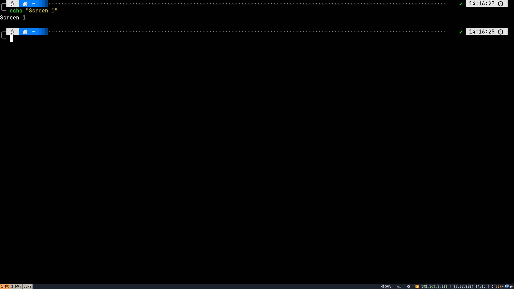
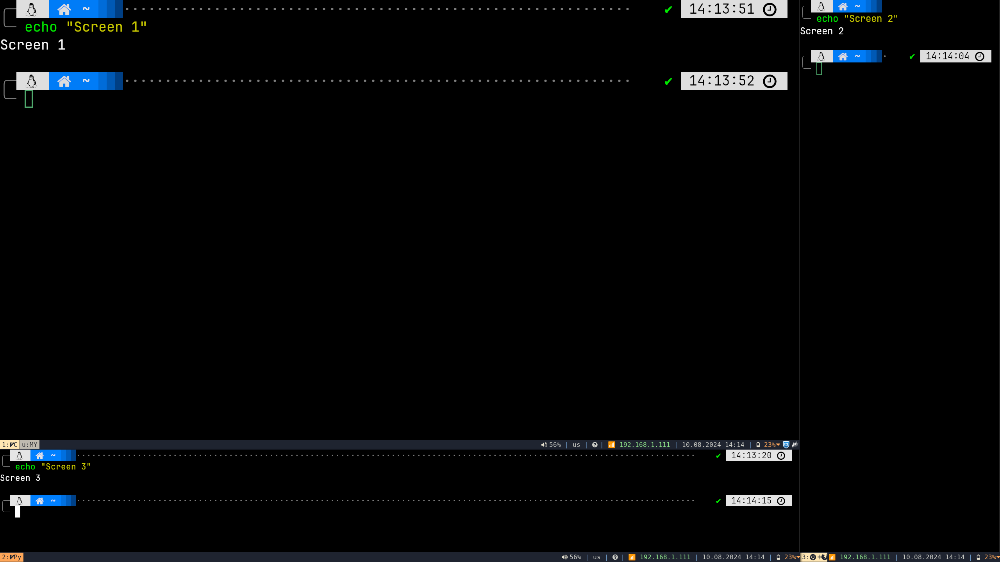

= X-Screen Split CLI Tool

This application is a simple wrapper around xrandr to split a single monitor into two virtual monitors. It is particularly useful for ultrawide monitors.

* From the name of the application, it only works with xrandr (X11 server).
* This application only works with the primary monitor.

== Example

Given the following configuration file:
[source,yaml]
----
nodes:
  - type: vertical
    nodes:
      - width: 80
        type: horizontal
        nodes:
          - width: 80
            type: window
          - width: 20
            type: window
      - width: 20
        type: window
----

Output:

.Before Splitting

.After Splitting

[cols="a,a", frame=none, grid=none]
|===
|===

== Installation

.Using pipx
----
pipx install git+https://github.com/elyoni/xrandr-monitor-split.git
----

== Usage

The CLI tool provides several commands for managing monitor configurations.

=== Main Commands

- `split [CONFIG_FILE]`::
  Splits the primary monitor based on the provided config file.
  Defaults to `configs.yaml` if no file is specified.
+
.Example:
[source,sh]
----
xms split myconfig
----

- `restore`::
  Restores the primary monitor to its original state.
+
.Example:
[source,sh]
----
xms restore
----

=== Config Commands

- `configs verify [CONFIG_FILE]`::
  Verifies the configuration tree in the specified config file.
+
.Example:
[source,sh]
----
xms configs verify myconfig
----

- `configs edit [CONFIG_FILE]`::
  Edits the specified config file using the default system editor.
+
.Example:
[source,sh]
----
xms configs edit myconfig
----

- `configs new <CONFIG_FILE>`::
  Creates a new configuration file with the specified name.
+
.Example:
[source,sh]
----
xms configs new mynewconfig
----

- `configs print [CONFIG_FILE]`::
  Prints the contents of the specified config file.
+
.Example:
[source,sh]
----
xms configs print myconfig
----

- `configs delete [CONFIG_FILE]`::
  Deletes the specified config file after user confirmation.
+
.Example:
[source,sh]
----
xms configs delete myconfig
----

== Configuration

Config files are stored in the `~/.config/x-screen-split/` directory. The default config file is `configs.yaml`.

=== Configuration File Format

The configuration files used by this application are written in YAML format. They define how the primary monitor should be split into virtual monitors or windows.

Below is an example of a configuration file:

[source,yaml]
----
nodes:
  - type: vertical
    nodes:
      - width: 70
        type: horizontal
        nodes:
          - width: 60
            type: window
          - width: 40
            type: window
      - width: 25
        type: vertical
        nodes:
          - width: 50
            type: window
          - width: 50
            type: window
      - width: 5
        type: window
----

==== Explanation

- `nodes`:: This is the root key that contains a list of nodes. Each node represents a split or a window in the monitor.

- `type`:: Specifies the type of split. It can be either `window`, `vertical` or `horizontal`.
* `vertical` splits the monitor vertically (side by side).
* `horizontal` splits the monitor horizontally (one above the other).
* `window` Represents a leaf node, meaning that this is the final split, and it should be treated as a window.
- `width`:: Defines the percentage of space the split or window will take relative to its parent container.

This structure allows you to flexibly define how the monitor is split into various virtual monitors or windows, accommodating different screen setups and preferences.

== Motivation
When the coronavirus pandemic began, the shift from face-to-face interactions to online communication became essential. Tools like Teams and Zoom, initially unable to share specific parts of the screen or single windows, offered only the option to share the entire screen (Because Linux). Additionally, Microsoft Teams prevented viewing other participants while screen sharing, which created challenges in maintaining effective communication during meetings.

Initially, I tried using multiple monitors to address this issue—sharing one screen while viewing participants on another. However, I found this setup to be neither ergonomic nor practical. I decided to switch from using two 24-inch monitors to a single 27-inch monitor. To optimize this setup, I developed a small CLI application that vertically split the screen into two sections. This solution, while an improvement, presented some issues, such as awkward screen ratios when sharing.

Despite these challenges, I discovered the value of screen splitting for multitasking. Each section of the screen functioned as a separate workspace, allowing me to effortlessly switch between tasks while keeping everything visible at once. Recognizing the potential of this approach, I decided to further develop the application, enhancing it with the ability to resize the monitor into multiple parts, both vertically and horizontally, to better meet the demands of a dynamic and productive work environment.

== Dependencies

Minimum Python version: 3.10

Python packages:
- `typer`
- `rich`

== License

This project is licensed under the MIT License - see the LICENSE file for details.
